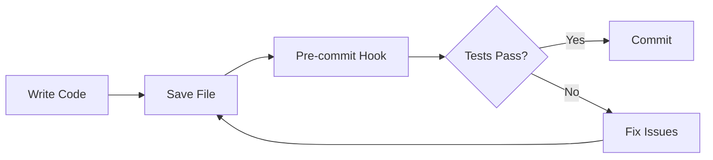
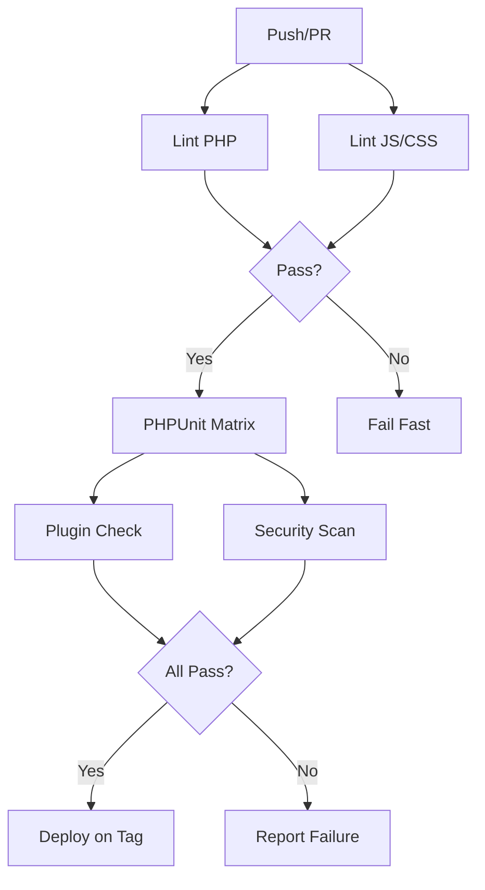

# WordPress Plugin/Theme Testing Automation Framework

Complete testing automation framework for WordPress plugins and themes. This comprehensive system covers all 21 quality dimensions including unit tests, integration tests, security scanning, accessibility, performance, and more.

## 📦 What's Included

This framework provides everything you need to establish production-ready testing infrastructure:

### 🎯 Core Components

1. **[TESTING-AUTOMATION-PROMPTS.md](./TESTING-AUTOMATION-PROMPTS.md)**
   - 24 detailed AI prompts for every testing scenario
   - Copy-paste templates for working with Claude, ChatGPT, or any AI assistant
   - Covers all 21 testing dimensions
   - Organized by category with clear examples

2. **[TESTING-SETUP-GUIDE.md](./TESTING-SETUP-GUIDE.md)**
   - Step-by-step setup instructions
   - Complete configuration file templates
   - Troubleshooting guide
   - Takes 2-4 hours from zero to fully configured

3. **[TESTING-QUICK-REFERENCE.md](./TESTING-QUICK-REFERENCE.md)**
   - One-page cheat sheet
   - All commands at your fingertips
   - Common fixes and debugging tips
   - Keep this handy during development

4. **[QA-TESTING-CHECKLIST.md](./QA-TESTING-CHECKLIST.md)**
   - Comprehensive manual testing checklist
   - Pre-release validation
   - Covers functional, compatibility, security, accessibility, and more
   - Perfect for final quality assurance

5. **[setup-testing.sh](./setup-testing.sh)**
   - Automated setup script
   - Creates all configuration files
   - Installs dependencies
   - Interactive and command-line modes

### 🔧 GitHub Actions Workflows

Located in `github-workflows/` directory:

1. **wordpress-plugin-ci.yml**
   - Complete CI/CD pipeline
   - Multi-version testing (PHP 8.2-8.4 × WordPress 6.7-trunk)
   - Linting, testing, security scanning, and deployment
   - Codecov integration

2. **visual-regression-testing.yml**
   - Automated visual regression tests
   - Multi-browser testing (Chrome, Firefox, Safari)
   - Screenshot comparison with baselines
   - PR comments with results

3. **dependabot-auto-merge.yml**
   - Automatically merges safe dependency updates
   - Waits for CI to pass
   - Requires manual review for major updates

### ⚙️ Configuration Files

Located in `.github/` directory:

1. **dependabot.yml**
   - Automated dependency updates
   - Grouped updates to reduce PR noise
   - Separate schedules for Composer, npm, and GitHub Actions

---

## 🚀 Quick Start

### Option 1: Automated Setup (Recommended)

```bash
# Clone or download this repository
cd wp-dev-prompts

# Run the setup script
bash setup-testing.sh --plugin-name="My Plugin" --text-domain="my-plugin"

# Install WordPress test suite
bash bin/install-wp-tests.sh wordpress_test root root localhost latest

# Start testing!
composer test
npm run test:unit
```

### Option 2: Manual Setup

Follow the detailed guide in [TESTING-SETUP-GUIDE.md](./TESTING-SETUP-GUIDE.md)

### Option 3: Use AI Prompts

Use the prompts in [TESTING-AUTOMATION-PROMPTS.md](./TESTING-AUTOMATION-PROMPTS.md) with your favorite AI assistant to generate customized configuration files.

---

## 📚 Documentation Overview

### For Getting Started

Start here if you're new to WordPress testing:

1. Read [TESTING-SETUP-GUIDE.md](./TESTING-SETUP-GUIDE.md) for complete setup instructions
2. Run `setup-testing.sh` to create your testing infrastructure
3. Use [TESTING-QUICK-REFERENCE.md](./TESTING-QUICK-REFERENCE.md) during development
4. Reference [TESTING-AUTOMATION-PROMPTS.md](./TESTING-AUTOMATION-PROMPTS.md) when you need AI help

### For Daily Development

Keep these handy:

- **[TESTING-QUICK-REFERENCE.md](./TESTING-QUICK-REFERENCE.md)** - Commands and snippets
- **[TESTING-AUTOMATION-PROMPTS.md](./TESTING-AUTOMATION-PROMPTS.md)** - AI assistance for specific tasks

### For Pre-Release

Before releasing a new version:

1. Run automated test suite: `composer full-check && npm test`
2. Use [QA-TESTING-CHECKLIST.md](./QA-TESTING-CHECKLIST.md) for manual testing
3. Review security scan results
4. Check accessibility compliance
5. Verify performance metrics

---

## 🧪 21 Testing Dimensions Covered

This framework provides comprehensive coverage across all quality dimensions:

### PHP Testing
1. ✅ **Unit Tests** - PHPUnit with WP_Mock
2. ✅ **Integration Tests** - Full WordPress environment
3. ✅ **Static Analysis** - PHPStan with WordPress stubs
4. ✅ **Code Standards** - PHPCS with WordPress Coding Standards 3.x
5. ✅ **PHP Compatibility** - PHPCompatibilityWP checks

### JavaScript Testing
6. ✅ **JavaScript Linting** - ESLint with @wordpress/eslint-plugin
7. ✅ **JavaScript Unit Tests** - Jest with Testing Library
8. ✅ **TypeScript Support** - Full TypeScript configuration
9. ✅ **CSS Linting** - Stylelint with WordPress standards

### Security
10. ✅ **Security Scanning** - PHPCS security sniffs, Psalm taint analysis
11. ✅ **Dependency Vulnerabilities** - Composer audit, npm audit, Trivy
12. ✅ **Sanitization/Escaping** - Automated pattern checks
13. ✅ **Nonce & Capability Checks** - Validation patterns

### WordPress-Specific
14. ✅ **Plugin/Theme Check** - Official WordPress.org validation
15. ✅ **Internationalization** - i18n function usage and text domain checks
16. ✅ **Enqueueing Patterns** - wp_enqueue_script/style validation
17. ✅ **Deprecated Functions** - Detection and replacement suggestions
18. ✅ **Readme & Header Validation** - WordPress.org requirements

### Quality & Performance
19. ✅ **Accessibility Testing** - axe-core WCAG 2.1 AA compliance
20. ✅ **Performance Testing** - Lighthouse CI with budgets
21. ✅ **Code Complexity** - Cyclomatic complexity and maintainability metrics

---

## 🎯 Use Cases

### For Plugin Developers

```bash
# Set up testing for new plugin
bash setup-testing.sh --plugin-name="Amazing Plugin" --text-domain="amazing-plugin"

# Daily development workflow
composer test           # Run PHP tests
npm run test:unit      # Run JS tests
composer lint          # Check code standards

# Pre-commit (automatic via Husky)
# PHPCS, ESLint, and Stylelint run automatically

# Pre-release
composer full-check                    # Run all automated tests
# Complete QA-TESTING-CHECKLIST.md     # Manual QA
# Tag and push to trigger deployment   # GitHub Actions deploys
```

### For Theme Developers

```bash
# Set up testing
bash setup-testing.sh --plugin-name="Awesome Theme" --text-domain="awesome-theme"

# Test theme patterns
npm run test:visual     # Visual regression tests
npm run test:a11y       # Accessibility tests

# Test with different content
npm run env:cli -- import tests/data/theme-unit-test.xml
```

### For Teams

```bash
# Clone repo with testing framework
git clone your-repo

# Install dependencies
composer install
npm install

# Set up local environment
npm run env:start

# Run tests before submitting PR
composer full-check
npm test

# GitHub Actions runs full CI on PR
# Team reviews tests and code
# Auto-merge for safe dependency updates
```

---

## 🤖 AI Integration

This framework is designed to work seamlessly with AI assistants:

### Using the Prompts

1. **Copy a prompt** from [TESTING-AUTOMATION-PROMPTS.md](./TESTING-AUTOMATION-PROMPTS.md)
2. **Customize variables** (plugin name, text domain, etc.)
3. **Paste into AI assistant** (Claude, ChatGPT, etc.)
4. **Review and apply** the generated code

### Example Workflow

```
You: [Paste "Initial Project Testing Setup" prompt with your details]

AI: [Generates complete composer.json, phpunit.xml, .phpcs.xml.dist, etc.]

You: [Review files, commit to repository]

You: [Paste "GitHub Actions Workflow" prompt]

AI: [Generates complete CI/CD workflow]

You: [Copy to .github/workflows/ci.yml, commit, push]

# GitHub Actions now runs on every PR!
```

### Supported AI Assistants

- ✅ **Claude** (Anthropic) - Excellent for complex configurations
- ✅ **ChatGPT** (OpenAI) - Great for quick setups
- ✅ **GitHub Copilot** - Inline code suggestions
- ✅ **Cursor** - Full IDE integration
- ✅ **Any AI assistant** that accepts text prompts

---

## 🔄 Workflow Integration

### Local Development



### CI/CD Pipeline



---

## 📊 Testing Metrics

Recommended targets:

| Metric | Target | Tool |
|--------|--------|------|
| Code Coverage | 60%+ | PHPUnit + Codecov |
| PHPCS Errors | 0 | PHP_CodeSniffer |
| PHPStan Level | 5+ | PHPStan |
| Security Vulnerabilities | 0 Critical/High | Trivy, Audit |
| Accessibility Score | 90+ | axe-core |
| Performance Score | 60+ | Lighthouse CI |
| Bundle Size (JS) | <300KB | webpack-bundle-analyzer |
| Bundle Size (CSS) | <100KB | Built-in checks |

---

## 🛠️ Maintenance

### Keeping Up to Date

```bash
# Update dependencies (Dependabot does this automatically)
composer update
npm update

# Update WordPress test suite
bash bin/install-wp-tests.sh wordpress_test root root localhost latest

# Update PHPStan baseline after fixing issues
./vendor/bin/phpstan analyse --generate-baseline

# Update visual regression baselines
npm run test:visual -- --update-snapshots
```

### Monitoring

- **GitHub Actions** - Monitor workflow runs in Actions tab
- **Codecov** - Track coverage trends at codecov.io
- **Dependabot** - Review PRs for dependency updates
- **Security Alerts** - Enable in repository settings

---

## 🤝 Contributing

Found improvements or have suggestions? This framework is meant to evolve:

1. Fork the repository
2. Make your improvements
3. Test thoroughly
4. Submit a PR with clear description

### Areas for Contribution

- Additional AI prompts for specific scenarios
- More GitHub Actions workflow examples
- Additional testing tools integration
- Documentation improvements
- Real-world case studies

---

## 📝 License

This testing framework is released under CC0 1.0 Universal (Public Domain). Use it freely in your projects, no attribution required.

---

## 🙏 Acknowledgments

Built with insights from:
- WordPress Plugin Handbook
- WordPress Coding Standards
- PHPUnit Best Practices
- WordPress VIP Code Review Standards
- Community feedback and testing

Special thanks to the WordPress developer community for feedback and contributions.

---

## 🔗 Additional Resources

### Official Documentation
- [WordPress Plugin Handbook - Testing](https://developer.wordpress.org/plugins/testing/)
- [WordPress Coding Standards](https://developer.wordpress.org/coding-standards/)
- [PHPUnit Documentation](https://phpunit.de/documentation.html)
- [Jest Documentation](https://jestjs.io/)
- [Playwright Documentation](https://playwright.dev/)

### Tools
- [wp-env Documentation](https://developer.wordpress.org/block-editor/reference-guides/packages/packages-env/)
- [@wordpress/scripts](https://developer.wordpress.org/block-editor/reference-guides/packages/packages-scripts/)
- [PHPStan for WordPress](https://github.com/szepeviktor/phpstan-wordpress)

### Community
- [WordPress Slack - #core-test](https://make.wordpress.org/chat/)
- [WordPress Stack Exchange](https://wordpress.stackexchange.com/)

---

## 🎉 Getting Started Checklist

Ready to implement? Follow these steps:

- [ ] Review [TESTING-SETUP-GUIDE.md](./TESTING-SETUP-GUIDE.md)
- [ ] Run `setup-testing.sh` in your plugin/theme directory
- [ ] Install WordPress test suite
- [ ] Write your first test
- [ ] Set up GitHub Actions workflows
- [ ] Enable Dependabot
- [ ] Configure pre-commit hooks
- [ ] Run full test suite locally
- [ ] Create a PR to test CI
- [ ] Complete manual QA with [QA-TESTING-CHECKLIST.md](./QA-TESTING-CHECKLIST.md)
- [ ] Release with confidence! 🚀

---

**Questions?** Open an issue in the repository or check the [WordPress.org Support Forums](https://wordpress.org/support/).

**Ready to test?** Start with: `bash setup-testing.sh --interactive`

Happy Testing! 🧪
